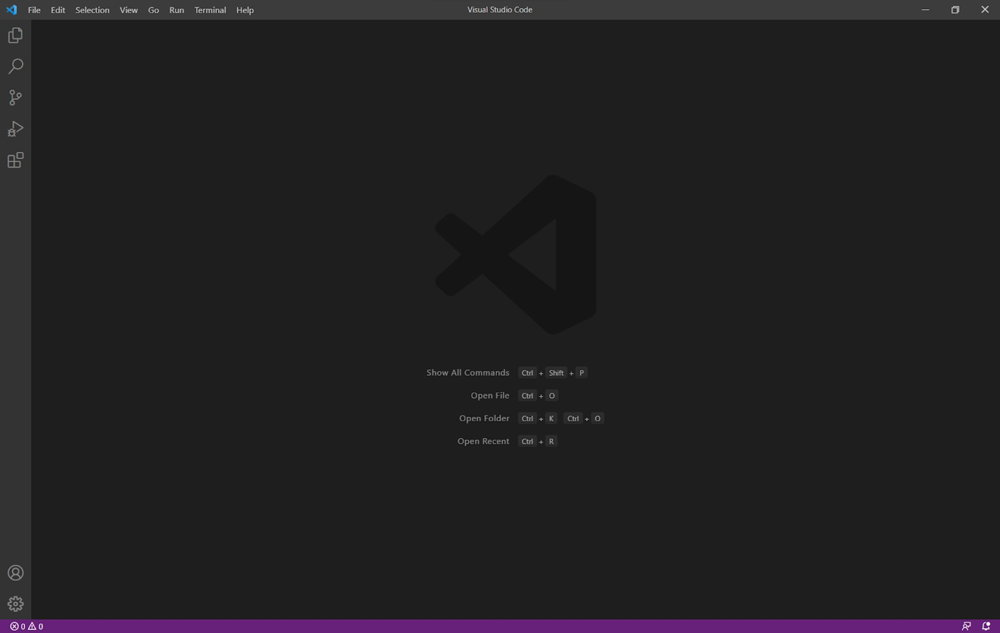
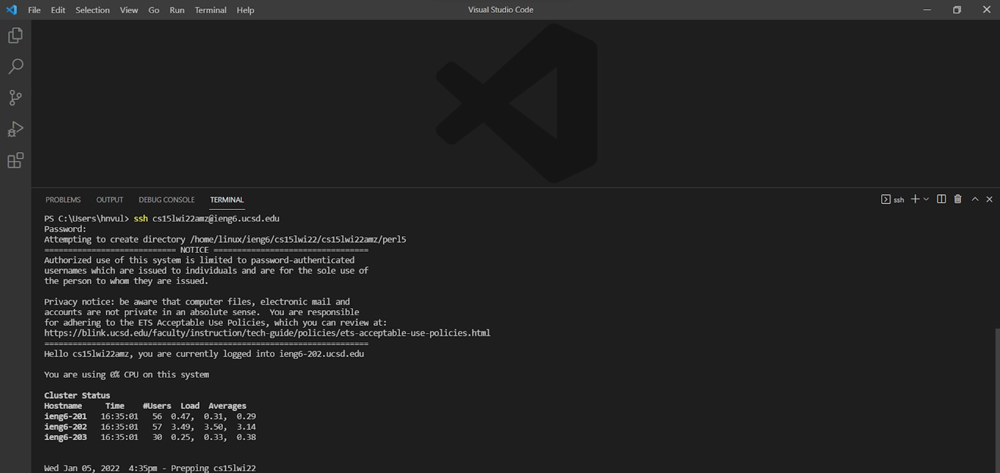
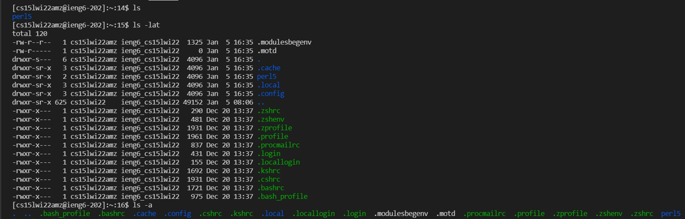
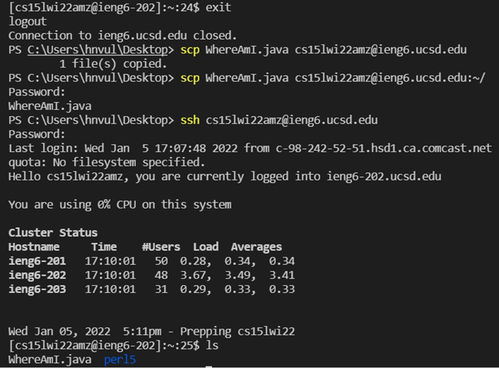
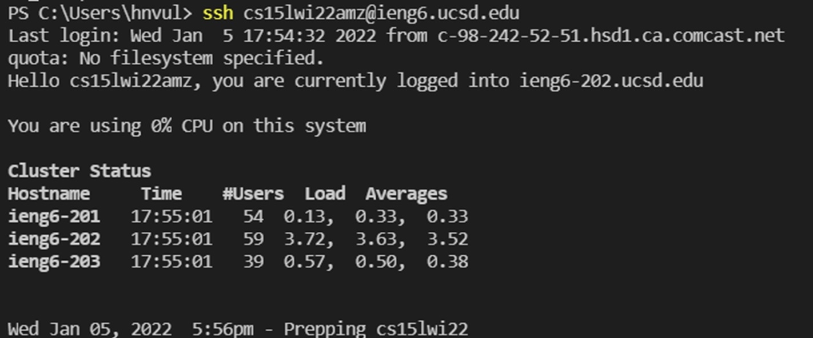
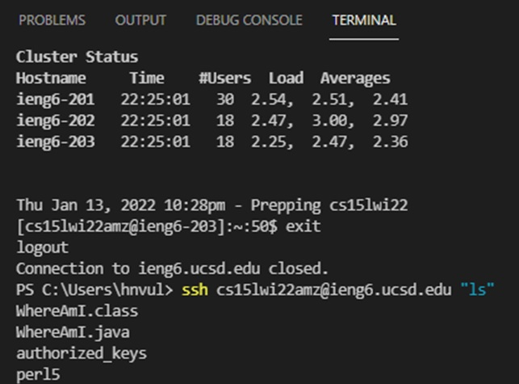

# Lab Report 1

## Step 1: Installing VS Code

To start everything off, it will be necessary to download **VS Code** for use in future projects. The VS Code website has all information relating to how to install the text editor for Windows, macOS, and Linux, which can be found [here](https://code.visualstudio.com/).

After downloading VS Code and opening the application, a screen similar to what is shown in the screenshot below should appear.



## Step 2: Remotely Connecting to UCSD's Computers

Within VS Code, open the terminal. In the terminal, by using the `ssh` command, we can connect to a remote host. Type `ssh [username]` into the terminal (with your username replacing the placeholder text). In my case, the command looked like this:

`ssh cs15lwi22amz@ieng6.ucsd.edu`

After which point, the terminal should appear like this, after typing in your password:



This means that your computer is connecting to the remote host.

## Step 3: Trying Out Commands

Next, feel free to try out a couple different commands! Examples include:

```
ls
ls -lat
ls -a
cd
mkdir
```

For instance, after running a couple commands, my terminal looked like what is shown in the screenshot below.



## Step 4: Moving Files with `scp`
Now, let us try moving a file with the 'scp' command. In my case, I moved a file called `WhereAmI.java` to the remote host, as shown in the screenshot below:



With the syntax `scp [file_name] [username]:~/`, it is possible to move this file over to th remote host, which can be helpful in situations where the code can only be run on the remote host (such as if your own computer hardware cannot run something).

## Step 5: Setting an SSH Key

Setting up an SSH key can circumvent having to type in a password each time you want to interact with the remote host. On your computer (not through the remote host), type `ssh-keygen`, which should generate a public and private key and should ask you to enter a passphrase. If on Windows, follow the additional steps described [here](https://docs.microsoft.com/en-us/windows-server/administration/openssh/openssh_keymanagement#user-key-generation).


Then, copy the public key over to the server. Afterwards, it should be possible to login to the remote host without a password, as shown in the screenshot below.



## Step 6: Optimizing Remote Running

To further decrease the amount of time spent typing in commands, its possible to just quickly run commands one after another. 

Using the up arrow key can allow you to quickly pull from previously typed commands. In addition, by using semicolons, different commands can be run one after another. Putting quotes around a command after an `ssh` command allows you to run the command immediately on the remote server. An example is shown below.

With this process, I was able to significantly cut down on the amount of keystrokes used to run my code. By typing each command out individually after making a change to WhereAmI.java, 108 keystrokes were involved (copy the updated file over, login, compile and run the file, etc.). The second time I made a change, I was able to cut it down to 16 keystrokes primarily by using the up arrow key to access my previously written commands.

