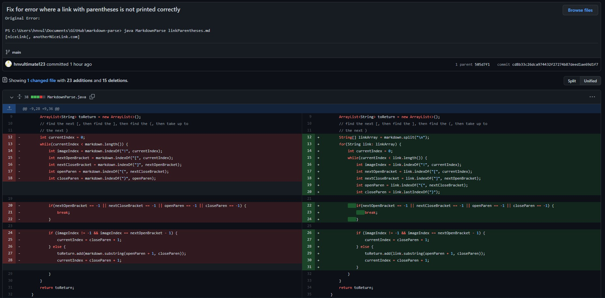

# Lab Report 2

## First Code Change: Broken Links
In this case, the failure-inducing input was a broken link, where due to incorrect formatting, the link is not actually a working link. This is likely caused due to the program trying to find the "(" character but failing to do so (the bug), therefore it continuously loops trying to find it, ultimately leading to an OutOfMemoryError (the symptom).

**Link to file with failure-inducing input:** https://github.com/hnvultimate123/markdown-parse/blob/main/brokenLink.md

To fix this bug, I ensured to check whether the next bracket/parenthesis character can be found (as they all would need to be present for a link to be functional). If it cannot be found, the function breaks the loop.

## Second Code Change: Image Links
The next error that was accounted for was the situation where image links would be printed as part of the output, even though they should not (since the goal is to find normal website links). The failure-inducing input was simply the inclusion of something that would function as an image in the markdown file, with the symptom being its inclusion in the output.

**Link to file with failure-inducing input:** https://github.com/hnvultimate123/markdown-parse/blob/main/imageLink.md

The bug causing this issue was how the code does not check whether a link is an image or not (distinguishable by the "!" as part of the syntax). The solution was to check whether an "!" character precedes the next open bracket, and if so, ignore the image entirely.

## Third Code Change: Parentheses in a Link
The final error that was dealt with was with incorrect output being printed if parentheses were present within a link. The existence of parenthess in the link is the failure-inducing input, with the symptom being output that does not properly include the complete link.

**Link to file with failure-inducing input:** https://github.com/hnvultimate123/markdown-parse/blob/main/linkParentheses.md

The above also includes a bonus fix for when getLinks is called without an argument (not particularly relevent in this case).

The bug here is how the code does not try and determine the end of the link properly; it only checks for the next open parenthesis without care for whether it is truly the end of the link or not. This solution accounts for the situation where the links are separated by new lines in the markdown file (or effectively, the enter character). 

The function splits the string by new lines, and then runs the code where it checks for the last occurence of the ")" character, thus solving for this issue.

There are still many more changes that could be made to improve this code, and even with these changes there may be further issues to iron out for other inputs. Continuing this process of observing symptoms from failure-inducing inputs and solving bugs would absolutely be able to improve this code.