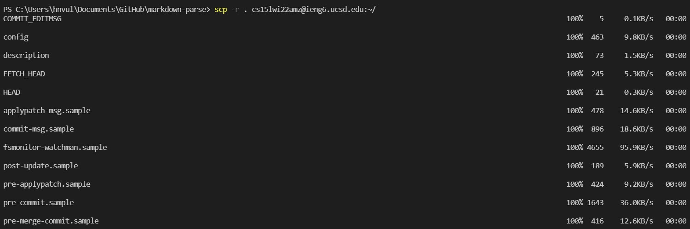
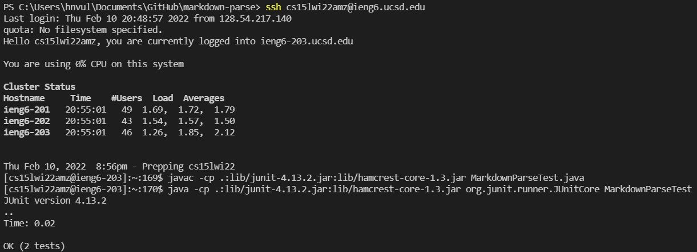
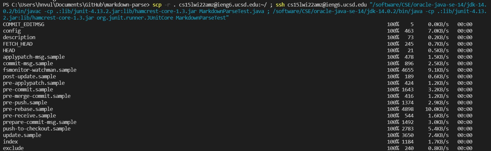
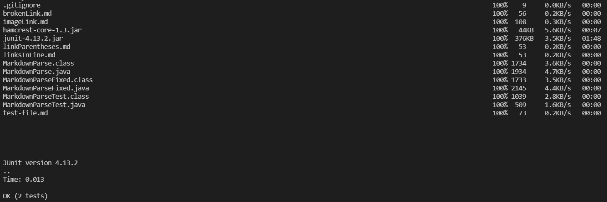

# Lab Report 3

## Copy whole directories with `scp -r`
To make it easier to transport multiple files, scp -r can be used, which will recursively search within a directory and will copy those files over to the server.

To start off, I ran the commands to copy the directory and the commands to run my test separately:

Above, the `scp -r` command is run and copies my `markdown-parse` directory to the server. I cut out some of the output as a lot of it is copying over each file, which is not too important and takes up a lot of space.

In the above screenshot, the results of the tests are shown, which is two passes. More tests could be added to the file for more detailed testing, but this shows generally how I could copy my files and run them on the remote server.

To improve the efficiency of testing my code, I can run all the commands on the same line, from copying to running:

The above screenshots show the output of running everything together, which is the exact same aside from being able to rerun these commands more easily now that everything is in one line. I also again cut out some of the output from `scp -r` as it was again very lengthy.

Ultimately, `scp -r` is an effective way of copying everything in a directory to the server. This ensures files do not need to be copied individually.