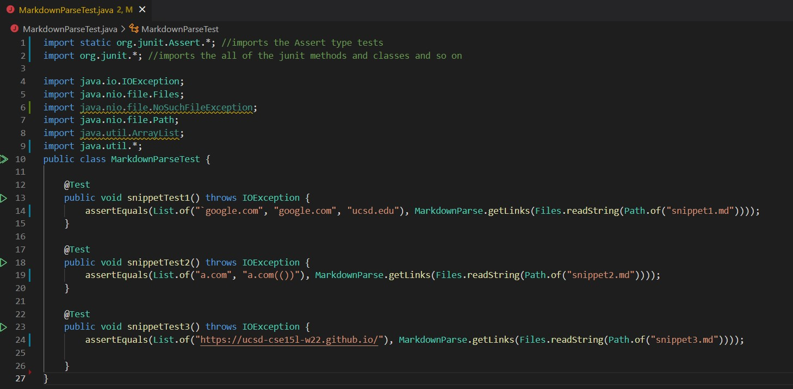
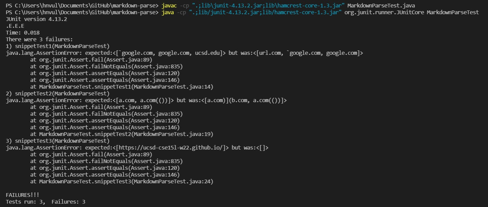
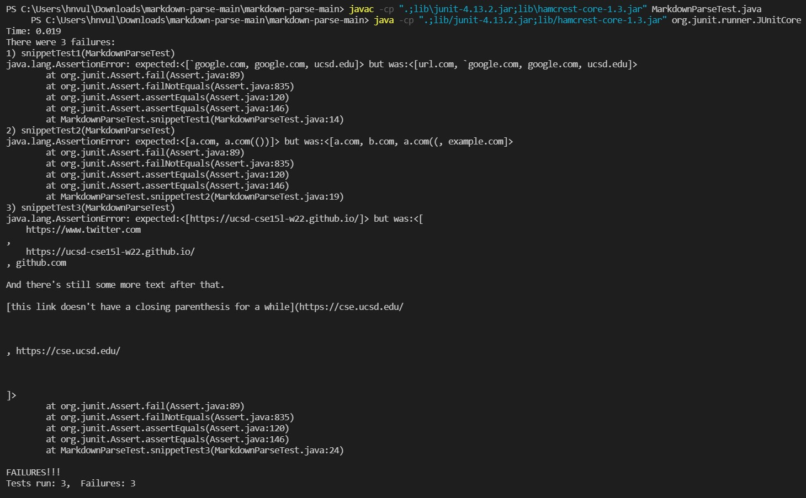

# Lab Report 4

## Working with and Running the JUnit Tests
The tests created for the three markdown snippets:

The output for running my tests on my implementation:

All three tests failed for my implementation, as shown by the error messages.

The output for running my tests on the implementation I reviewed:

All three tests failed for the implementation I reviewed, as shown by the error messages.

## Understanding the Results
In the context of my implementation, the third snippet were able to run without problems, with issues appearing for the first and second snippet.

For the first snippet, my code does not seem to be able to properly account for backticks in the code. However, the fix for this issue should be relatively simple as we can check for the indeces of the backticks in a line, and can then check to see whether it encompasses crucial parts of a link or even just remove whats within the backticks from consideration. That way, the proper syntax of a link can be ensured and whatever is within the backticks will not be touched by MarkdownParse.

For the second snippet, my code fails to handle the nested link properly. I feel that this code change would easily require more than 10 lines of code to be adjusted, as I would have to include a mechanism for the code to be able to determine what is the true link on the outside. The interior link is syntactically correct but it does not appear as an actual link, therefore trying to make the adjustment so that it isn't considered would require a more deep change that adjusts how exactly MarkdownParse determines what is or isn't a link.

For the third snippet, my code does not handle the newlines properly. The fix for this code would definitely be a more intensive change as currently my code checks each link on a line by line basis, thus the getLinks method I have current written would definitely need to be restructured. To fix this code, I would have to ensure that the method can continue searching for brackets, parenthesis, and text even if it split across the lines. From there, the method can determine whether the link is valid or not from that information.