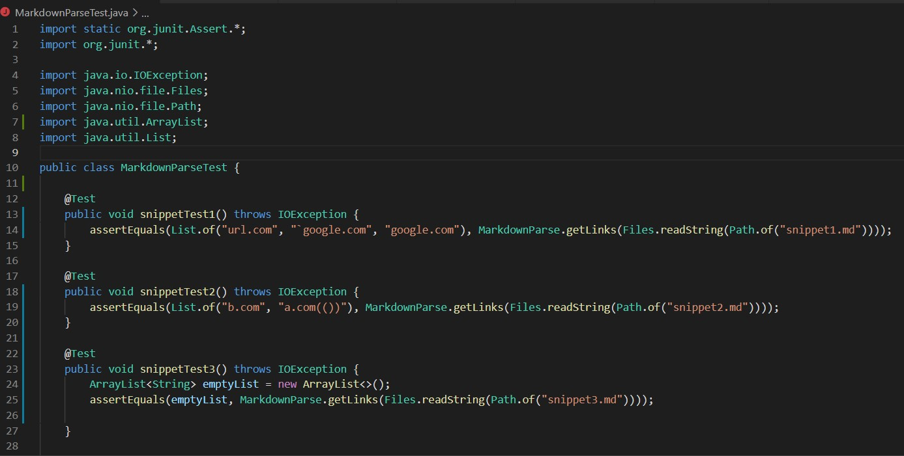
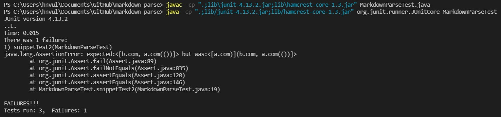
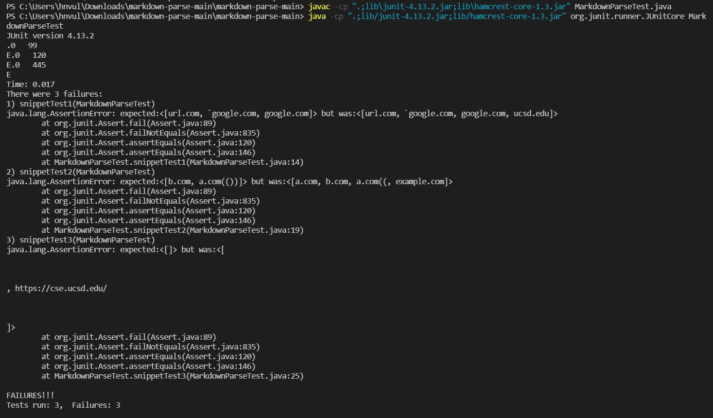

# Lab Report 4

## Working with and Running the JUnit Tests
The tests created for the three markdown snippets:

The output for running my tests on my implementation:

The output for running my tests on the implementation I reviewed:

## Understanding the Results
In the context of my implementation, the first and third snippets were able to run without problems, with issues only appearing for the second snippet.

For the first snippet, my code already seems to be able to handle the inclusion of backticks in my code. My implementation of MarkdownParse is able to focus on each individual link's syntax and determine whether the brackets and parentheses are in their proper places to be treated as a valid link. As a result, no new changes need to be made since it already can handle this situation without any problems.

For the second snippet, my code fails to handle the nested link properly. I feel that this code change would easily require more than 10 lines of code to be adjusted, as I would have to include a mechanism for the code to be able to determine what is the true link on the outside. The interior link is syntactically correct but it does not appear as an actual link, therefore trying to make the adjustment so that it isn't considered would require a more deep change that adjusts how exactly MarkdownParse determines what is or isn't a link.

For the third snippet, my code handles the newlines properly, as it recognizes that the links are invalid. My code is able to view each line independently and determine links in that fashion, which accounts for the various newlines and prevents them from causing the invalid links from appearing as part of the output of MarkdownParse.