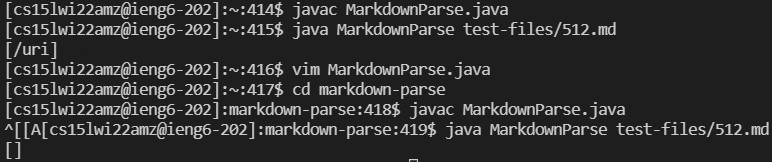
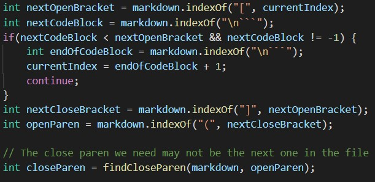
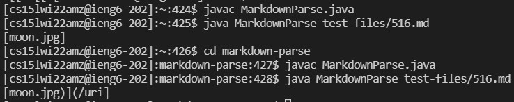

# Lab Report 5

## Two Tests With Different Results
The two tests that I observed had different outputs between my implementation and the implementation provided were tests 512 and 516. I initially ran the bash script on all the files, and from there used `diff` to pick out differences that interested me. After that point, I ran the tests individually and looked at them more closely.

In the context of test 512, the outputs appeared like this:

The former file is the implementation provided, while the latter file is mine. I believe that my implementation is correct, as within test 512, the link itself appears to be invalid, as it looks like this:

`[link] bar](/uri)`

The nature of the brackets cause this link to be invalid, therefore the result should be empty, as is shown in the context of my implementation. I feel that to fix the implementation provided, we can look towards this segment of code:

The code is currently unable to account for multiple brackets, rather only looking for whether the brackets are present at all to be classified as a link, meaning that if those conditions are met it will assume the link is valid. It does not account for extra brackets that mess with the syntax of the link, which thus comprises the nature of this bug. A potential fix may be to check whether the next open bracket is right beside the next open parenthesis, which should be able to account for this bug.

For test 516, the outputs appeared like this:

In this case, I would state that both outputs are incorrect. The test file input looked like this:

``

This link can be accessed by clicking on this image, which would take the user to where they would need to go. In such a situation, the actual output of the parsing should just be `[/uri]`.

Once again, to determine the bug for the implementation provided, we can look towards the same block of code as before. It has a similar issue, where it is unable to judge the layering of the brackets, although unlike the former case where it misjudges syntax, the parser focuses on the image link rather than the greater link overall. The bug arises from how the code finds the image link and returns that value rather than continuing the look at the rest of the text to find the actual link, which is the main bug. Accounting for this issue would require a fix that can exclude image links as well as focus on the overall end link, rather than what could be contained inside the syntax itself.

**Thank you all so much for an amazing quarter! I definitely enjoyed this class :)**